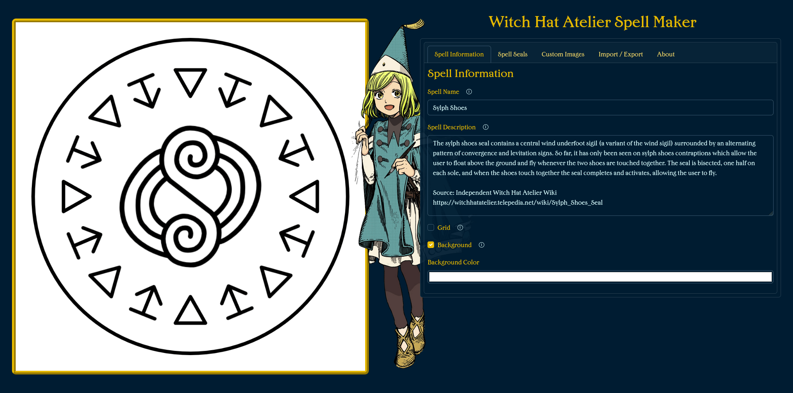
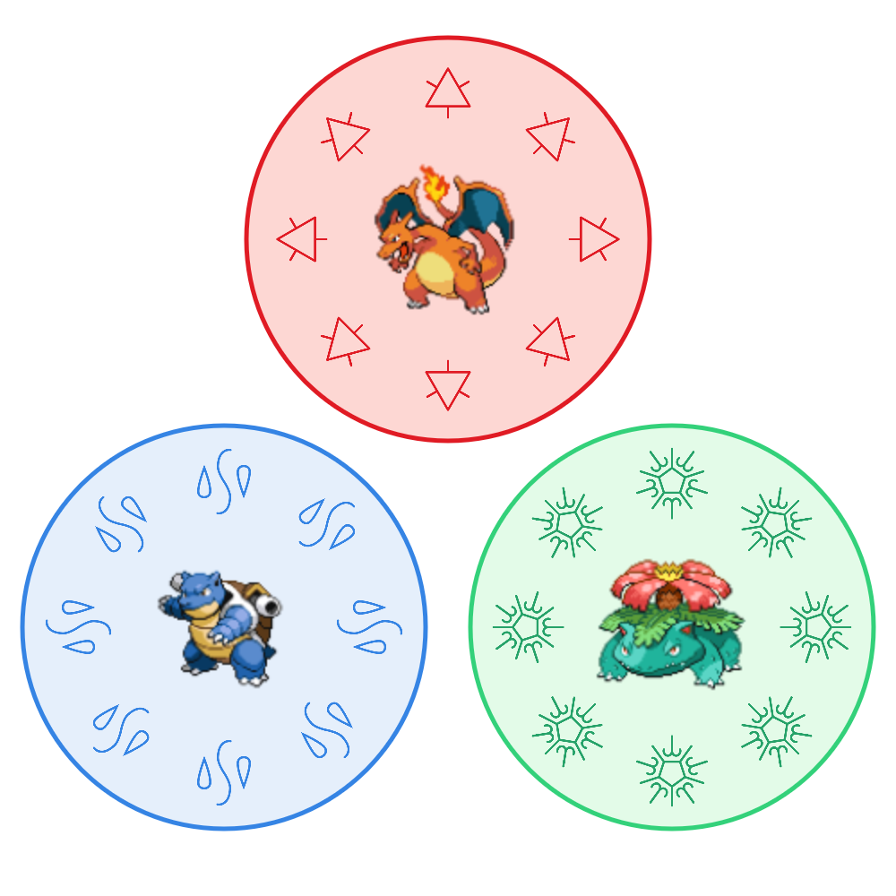

# Witch Hat Atelier Spell Maker

  

  <h3><a href="https://wha-spell-maker.daviamsilva.dev">https://wha-spell-maker.daviamsilva.dev</a></h3>

  <strong>This project intends to provide a way for fans to digitally create and share spells based on the [magic system](https://witchhatatelier.telepedia.net/wiki/Magic) of the manga series [Witch Hat Atelier](https://wikipedia.org/wiki/Witch_Hat_Atelier), created by [Kamome Shirahama](https://witchhatatelier.telepedia.net/wiki/Kamome_Shirahama).</strong>

## About

The editor allows fans to brainstorm new spells by easily and quickly adding, modifying and removing the different parts of a spell and watching the result update in real time!

It is very easy to use if the spell follows the standard ring with signs around sigil structure. However, it also allows for more complex spells if they are willing to do more in-depth customization. It is even possible to upload custom images to use as symbols in a spell.

The current spell is automatically saved locally on the browser, but fans may also choose to save their creations as a JSON file for backup or even generate a link to easily share their creation with others.

And just to be clear: this project is **not meant to be a replacement for traditional hand drawn spells**, but rather a way to make creating new spells more accessible, standardized and easier to share.

## Website Preview

## Example Spells

You can click the links below to instantly open the spell into the editor:

[Sylph Shoes](https://wha-spell-maker.daviamsilva.dev?spell=XVLBihsxDP0VMacWhqQs7CW30ksL7SktOTRLUGaUsVivPNjKDOmSf6_kSbdNGfDYftLTk_xeG8EXajbN9hLHANuQqDRt01PpMo_KSQz7HghKxYvjUAgjdEkUWQogdCSa7Wpm6eEsPeVTSgqFB47wDmHCzCgK6QRqVDWsgu-hnHNOntLD8QIogFEpCyrLACOqHzzPqk2UB5KOLKqHSBMruj5nkrKCbYIT5hZYIWCBJPECRyLDffG4fzpw8RlrfwXmwF2wwjHNVd-5UAY1uphQAY9pono_VKW1_MnI50BCk4capnO6UWO2Uzp3wVrSNJCheQV1hD42LnDkQp1S35oqMrHx5PIITURJkdpawdkr88JaGd_4FmB5hZcxknpdl9YpT2indmnHh3jf0WW1l71s0zl3tIEvNviRbLHH2bFahc_W8UelyJaw42feS1Ady2a9nh0PaEOv6Mp-ltszroTU0GdeVw8dqocOW1NnRnKRpdn8fG2yiVl2N8d9M_c01yeLcSvcQfXmsHOf_PhjJyfjX4Y-Pn64Zcn_SXL49NcnzbW9x76-eca4crptNw8P1yf7fgM)

 

[Pokémon](https://wha-spell-maker.daviamsilva.dev?spell=tXjHEvQ4kt6rjH4ddGArWEVfrdgD6L33io0NerJoi7440Q-k59CLid2942JHs3OQcAIQQIIfkPl9mfzjjyHpix8__zDH9n__r34cfvz0Iy-WbG6mtblHP_8QxnVN_pAly_qH_1b0f0i67r_ca5Yi6ZYfP__PP_5pP9_Mxa_zWdLdQ_zx04-xLJdijX78_N8RFP3px9wM1e87srEb53vLfy0ezxTB7l1l03VF_uPndd6K30fMn9aUeU7m6I9f_vW23VTN3x6abcs69v_G1MncXMmc_2nZ8PuqtRnWv5j9j8f-u5Xf7P7bbwB--ddffvqz9SBZi_nvYQp_xfQ3EJHH4-8iRHEKK_4ThAVelGX6jxHS3X3_Y7MU_xzCPx_7Nwh_x_M3EIU5WZb_C8R_EiGaP8nkP0GIlmlB_WOEfjGMS7LN_xxAhEgQ4vUfnrAbj98R3jZ-t_vj5z_-aPqkKn43d3_Wr8vzZE1-_m0anobqf6TJUhDYT41PG_bxUIRqBHfTHa_mvOruCb8O6YoG2q8da-1H9deO6tOaz3ng35tk-VKV4XYT9Qqr2W_da0X9ytDestmt-g7bys8bOuzIRLPw02bhu1Frx4S_7Q5tx-00YBlpFN9n0qou2xzvBZq59uxzxrkoOpHC-ArfKShBmy1slL3qI86jUupQi25so4ro7gHs_BAYybFzarA-JCIBAf_gX8yRFfF4k3RCxujo-4KpOpBrtkWQtGgepue65pmvY21Z4kTZwjOx5tabyN-wnqVBC2_1tNbY96vqu3HmKSA4A4ntCkXClCPMCcqi4FP1RUyf9DMIMXAwAxW_mvczqG20XoFZaRLI6s0Zv-m0t1MWydWCU6NMGGl_qezGImvVvudSrqSSy9iFr6hYz0AmIKZRo84M65KM2J5VVepTcgXLpj9PG9I4SFxd7TADq7MBxQrWWFvEk2QQoIO0jrvGYuS4p6HsLeFlV2Svqk-0AAMZ4CCObt6mrfJhBLEhxCMi4CWCMl-ddTtjXTV-_tCSFIT1CR7fhFTpl645ENsGosePllbv9DGM87kDcspZJvMdjNH24aV_-VH7KG2-hnpfZQb12YsLFGa6WHNQ8Tm-Qe3HUr9fS5Bb0DHdx9afih7RXDuWSyCC1pOyMtgAChTZPY-uG-lxsnpaY2Mr_UA0xiU9iOzRjh61BNhceqKz1aS1xtF2G118GxH35Vyc9znoy3Vt7bAzzhMiG1dif-xXqd44TkNG5QDJqwqo2m6bp6oZyQfEuiVnZJseLlqrUc1RHltMutyFwmtNWPa0gnlva7dut2fd0fEzBFbmhSOZx-vD8M4GFRxu70Hh0hzPXk3aP5vMtZboBTRyuJRQI0HXV3JZsSVWVJKFYPKJxx9lUNUgrQNRaqn-jAWNOzhPbYyH8v0ES16LIk0_KyNyS3Aye9BNTlBnCY9FVc0tuLt_aJ2EO8L-gCGaG9k-ygqpGF9ZmTCRPKMIgj7lzr3StoXBckm2iPKtzG1O59bDJuJmKja7QWWT50rYM-3qoZoVnyioXkPPmDExPEVwRXBi5qN4J9xrFeHbIyycl4fL-onKpM0LoSpzQNYT9vpYQvWG66nARbrJoZupqC-dzZlT6-hGrGkZ8yfQlK4sWN_iZKQYotf3koovYk0O4xuMoCzyOvk6Y95XFNud-2i_RPbExCyzjdt1xWxwjfIyiYfY-7SVYjTyfn-76-AxgZy5nnqFtALRE_AtNe7UEIIHc3-ee2MtgBNmtgWj9BC_-QXeL_VB40vKp6MDbv6Z0AIfBuk8p7l_6l-iD-hdqp_yy6Jr5RyO1No8xny1ndt-dhqJU0zb8W_lmyaDDPmHIIBgHZX5ocJD73niloB0CrnZmqLA4kcl5vDrQF79i6iMFupY_QPYSZvqfES_fSYnQH-Bm8LTWRPyWUUIUZSTZwDYaG1fzbJHs-aEIVQcpsXNBVBBAsS4OccqhT7imInWMYGWhn1yw5bHTdbXuz2AwlM3STsQnWfujjVSfYVPd1BnL9-emWbMjLv7Gb0-tjvuEPAWVuBXbErJjZo6KZo04JlmGWLa91fZ91ILWMtcrs8xlS4D9jiJmxAPpLoFSnpOMAabBqAHwXFktKJlK4xC4NuND1OPRLydDf1N5tQj8Qo56HtChUhD-oa6AdTJTWjxul4eBeuHGDnxAl4bDNGhkUrxcwdN8yawoIOl8uhgU1RTolmSUpxIalv3zlmhFwQvDQKSWkU9CBbEr4Zf8Grk1HVHs8Adv2mYbHs4N7dyVVX_8i9_kc-_SqB--v8nkpIRSBZHgyr6nIrTTolh10lDIWrUCl4nO95spPqVh_7Mzf0Zmsgzvm6NhJApqe2_K5L0X0Sym1-z9Mi885Wl-AFFoaNl9WHuLeyxja3HrFUzmMzyYS8_MvrLnJH3cW6yja2TqZ1NxZ51JgKHtRT_uddMz2lulmVBtg2uzPtpVjuPjGdr79IhS__uMePk884_kj1I0tdr2KHL3883Hayz4sP-S8BX2NzHuSO3xzfqaOWdens5Xu-dIs1A0_s3L5Ij3Ypfk6eVTPDkcDyBh73hM36jCFmSCCUMGsUJ5gINpfyCX93LEumgr0w9F8RP_vpAkSVRj4PO8fwc3r50hbHrwh4pXqTLI4TnIA6jw1X2mprZ70x1d7fi8M682TK7EFZtXZxUvMWKV3yhVnN8kpk5p6fEKzO9HCP3yTXeN_eFWcWzI6_6bp022_y2YOIcesVZx1EOXREDVJtk3uIE6BqrpDLL1q36Pfp87Sfu5gIDDiSA90If6lNdZniR5uiT7zttLHRJO-4MzUWO1J2o2JqysMgXLeAV79XetTNfjb2Tmr7HAkwiRdQcSMn94A-NuAynH7piai1Lktagd4xk5HFOxGrcy-0Z2nzFywBzAHyko05SWCctIFbTD5YpaXUdwCjK1K3Gd0hhUuM3nDG8s9DwynA7uPOKZzOWnPrEq_jgjqyqrO-hDGYngRho2avEpnOxcTo9-UO0vJbOR_FiGljHzqsXYPjxhs5wCKkzcc_PkUcjx5wGBB93UFchVsou3kMZ5BMbYzwrjpFpz17Lb6owEu8ya3wt8G6qQl99lVujhRdTn471YdDTht8G88CxsCo05wO2utHF5Nqf8AOyKBZNqMXUW3tqUGbx3uT6gjD-fYdbXbQjQC6Sv32hlWbKorLtitis8B5qyZLf94uFl8E-mrp_BJJRQt82j6TP8XaWpbL4mq6egSkOS4T7j0pj6U0-h4fApDdbKU_j1KlHo9tvL2EOJ7nggiha2k9Clw9xlrMSmEflp8KBLKKOJ_4uCiPwXnfGVSss4nAFCwmf-dvPBidlkRPWNW5R50dwr9fGcisv3clkDRve3EN9nliJj3k6Y920AHyx2xoaSWuoMukPxTCUL2xZaj0fXN5t6EgZaFnXCNcJr8fGEvAkfByfenMfKoVet3qWfTfrWVQhqN0R1PFSdwblWEzgS2etPSc7VsPKpHTMO4uWfMfE3FFpxYwddJiBl_LgdYchNnauaGcwwe1H3VvPapp3g_pL5I5rV8FRgG_NEYXhBYR3Mc-IcKi2YF2jsOTGkLs6PuKdCJBOeCTMxiD1DAwco3soGGO54vsqjlhMijnZHTJC2li-JEeVN3wQHeL35BHOX693B-Xz6rfjdCSmUMTnQK0QrLwkIJ9NAbabGowwu3EZPK-2IX_ReWIb-GEVp0iNfOEinodVeTuJrPPMje8ulNi2FSAz7yz5mS4IsqSCNweICgPly9DOWHPT_nvJw3W82zqb1TPMX8Tkr2rV_9diovF_FpNfheSOPM4qkLFa5TMZ2C55ZgGrWQyLDtsreYuF5YnF7gxwgZrwnqIw2am_CopM0UH0dwUl7P4iKNdrFJ5Zdn59mgsdYnosjf1FdDhxLjvOquEFPrO4jqwf4WMXfAthW_OhlgzAybTw0vmGY-g-s80MZ-UKKlDNq67aNkGspdrkbdXqdB4lvuCclJshcLDeHT2TNtedzCD0CaEQvL9wrOWlITt9lLJPLtxe5mCt30LFSXzCGYQhC4lSz5QrhByKCVS4IEVEOKhWq07EWJsy3j6V7G944i5hfTKnwL90US5EZcUw8g0ZZPPdzuuOgRClBBXuEYMqiwyDx3DYrzVXB_CRNGx73R515EsUHq2FlChXiycsc-78hso3DplBAZXWeQ0rGeKNNZO7kWE7BvNYSV6w2Fz1wJE8NeLn9DHqgiUFielCNk9R_tTJo1QmRDJhqqxRLEas9NAryebRndWica3U9bPt4vKSAXN9DIgooCLnSAeLDKQzh5p9YjKpAQQdKP50DfhhUJPK9KnN3bW31qYRyFQHa44ISCqg33XGcR_ifaVlJXJuIh0-1jNQQo6uNaiaGoCTz40qA4Z1JwuPtvYqpZ1GIOMi28DRvblnJCqLP7EsP4bL5uXxS0gPKqCrjdY_BkF-iuKU17tUNtpldAGNKyxUpO9PBCpV0wHWK88eHHf1tS-OQE3N87jdGLD9ND6KpNKLN8q7INlSYrfTgK-pzs5sRpYn81V-Vlnq0TJ_ouKLgsJBxSYJRJUWvIWR6TFMfeWgtV3rCC09OGtNoYXgeefhqdqyNq9P8tfLXjCEBVwZDPX0OFBQ5UyAa8XY2mNjydr6CCb7QDHFMjfwYEK87p97dVMTslud6NOJZ03zC0Fui3JzKjjwPHk5CCzigylMzWWSyrJWKr8VR4agG5wBgjTe9NHQK6k3xPVMZNo9XEjZvIgPH4c38d9cd-zVcLoJ4Xvu1-z76zW46e7pzCCsnl0rcHryqWNCVzCfMPYdtLEb02esdRT7zgItoTM6cGbJFzefGL_TTALGDyKdN6rEayIMJwM_7SGSJoMKbq8UiYklXz7UsMRy7gh18mQNgQizZjmRpVY3C8Pb1clIISPnIOiGtzNaFZsrAtlmR-kYpKQI-a5Z32RsZ2rLLMJb8kZ_nu1esqjRb07rcq0zktq5ZWTkOpHApWVOeMqX7PpCZ62CFnXetpU8gcxH4MCoYsTB61PZXIx9Y1AJ0sydVoaGW6rY14x2efROHo1Ed3B9gP7hiBs5sDGUBiCpmseGtr0ja2h8CgEjr-mieM-P6zxoD9QaEQBXVEMpm-aAfXUJ4GVRXqyZOabjSlORXUZnIzePLJI30_sGdnZjSrGCcVnS93xUZAkcUG8I0x58awUkAGJiJsTnAMEXPu1GTJWs53qrqCxXX6QPN1dSALgG2peHer-dXiGSlGNlN0fartWAf5wyTNGSh9foAYhNVoCTPC5bxVSaYp5778ZnH7WXvFMRgjIz8ADzWQa-1deMKWFW4wMTFVEYFyQFuYuL2zfPy9qUiS1bjSYy1Wfnhe4UUX7IoLAM9MsDsCsAuHuW3SzilCBQj2JcxCPAOSV6AF-lQrGWN1LScWBKsinYB0QdMW1tOrF_39J1RLI9txoVz5iwB9ySvI_2LiHIcTETvMRhIzmdY6VlN_L7mKi6-myJSCXie3aE0mgmb1qrlQc_N9yONiKhY7ZoHMczec8SA9_6WJcZTctOjdUhNvoFRbMJnko6W61eVjLqMCk2lcFv3xVzrjK9wvNPa3wKyiVSwelAi4NglVXGuvGtMl57VbSKOTBuY-8RRKEcTtbgn6QfLy5dVVO4BWoRerizVPp23e8h7HdF_OZZcmjqR1iWxlo1BqypD1pftvdsiKmcf3E8K4OrRDGq3r7zsX370lUkdnvqNkzjXIi0ZSHs49aEYMhPHoZDiC7d1-m9uOaSouofVZ9_9ev3l1_-Dw) (custom images and colors)

 

[Washing Machine](https://wha-spell-maker.daviamsilva.dev?spell=7VbRbuM2EPwVwk8t4Ma2ZDtnvwUG0j7kWjR3QAo0gUFLK4tniTRIyop7uH_vkFJkybETF3ePBQI4onZmh7PLpb72JM-pN-89cJMKuWYfeYRf6vV7MZlIi60VSuL9rdDG9plNianCks6VscxsKctYzjdkGMdTSlpEPGOa1kAxvlI78pAqsMR7YiUHnJUic3FGxHTFPqfCMPz5UOip4_8UiaY9M6kqDVuoSDEhWZTyrSOYhA5HWJJtNX1kEVHKIi7ZiliiChk72I5vlWarYrXKyPh9SJZAg0uKzFwThyab1vISrXIvhwvdZxHeWucOrxmuHuWj_J2erQP6OFsqCIAYF-aVIIuSxKJMRZtSGFBBiV-BJuRoXlyx-8ovI9bSsK0S0ieD6kYGxWt4HCmZoDi1pXivEkYoWO2XVfUbHhGLhabIZvtDFXJv2J6VSm8QuyasaQdKssK6TTswVOHHGeKc6zOeZap0ahyBCy7RKIx2JLO9d-GOm4MLae1TZQDkJY0oFNrUAgqYEWllTAp3XUDOpUgIPCXXOWrwUyJcoxAaS1LMVnumeSx49jM8cUSe0Req7h1YmsVwzhKsg2Q0jVVbH9YufO2TdxVexgQ2qK1KvhMciyrDSp8Zr9r3nmPWlHPYXUi83UBRU5eKEPUUmX-u8yRK58bbs3CtU-2hGCxS4OBQdJvBsdGjTK3dmvlgUJbllaY4FvYqUvlADx6EjdLfuL2xlAnSA6zm2JsZjPSXoNw8D8rqvC7z6rwuvZDll8LYpYWzy70q9LIu5lJInGdDPDO9-d9fX478R16t48TicTrs9zQYOyH-1COmJLFObW8-6ffUllyPfxL_IOC6eb6Ra8cSTEbf-g38EzmXgXflK8AcuiwNWSsSVdTtwOD6TOAt9mXTVuTow7lIkXQDh53AJ-xcrEXXEr-yfHD94JzxexxNhnWwPI6Vy1-5O0SHWJfjJeEM7vDcHXbspyXMAxcqK3J5GjgaDw_I6Wukyi7ABVhXllfj2-3hB9CERyzw6gYj33d7w3V9EdXsNVXX9plDVk01azEGQYsxPN7UHe1EnaHZWnAgCq47TJMWU1vb9JVZ1YDubLGm9O3XUI5blNO3nLuYMgy_i7JRNvwxNLNLaS6tZzi6vArvVLdLe75N3pLW6ZBx27Txeyd41EEGLeTbdv-hV6fP4XgYniGZ-omEu4g6E-mOkqNh7b8lqpjn3vyXcTUG_L84gE8tKfce8wb4gK2gbXCduL5JXElw8xuyfyFR-GHavlhe-EfHV0lrob5LRrPw_Sl9fjQvXr4wGnfDYbdZzg7ne_-1cRJX_X9qop2YGudppmcndfD6IOEWdh_k7fFwbqaeKumpsnxHVYbB_1X5z1V5-vYv) by [u/ChromaticFlare1](https://www.reddit.com/r/WitchHatAtelier/comments/1rj2wkx/washing_machine_spell_just_toss_your_clothes_in)

 

[Crystal Petals Path](https://wha-spell-maker.daviamsilva.dev?spell=jVJNj9MwEP0rls8lykfTND0hLYIje4ATW1VuM02sTcaR7aqUVf87M3ZaAhQJRYrsmffezDzPm0Q1gNzIJ3txXvXiGcJf-U4uZAPuYPXotUGCfOm0E26Evhd80IPulRXeCN-B-NSbs_MGIXAjbCH2Jy80Og-qEeYoWkCwymtsRa_bjnL-FgMnDrEF_QMaMXIbjpSVFzCAbUEcrRlCqRM2YBG4DF9DVWIb9Eoja4coMP_cARIAxpE0DSYv-NXdEFM5GqTVvVDYhOiR5gAb63MKxdHYkNkrBzxEUI_jxaM6UHmNYg_-DFTvscxZk2_qcDDDYBqa9wajAUP-1oCF8dQ7cjyGyd5BvcJvomYUhoydepmi97b4cYJFNO0LPlkyiobfX8T7z6-r1ZqeNXgjN9_epCUzwum6pTAbEePTUoTIbloNJtLbyE1eptfFL0ynRtg9A7nf0prcQMuqnDTxT0ncfdDUqeUh7_giTRfSqkafCJ7XdFGDOaGXm5Lixqu4hMVqXpq1PrKFd5msmstUM5ksnetka-6u17Q5obvRaPTxeJGbdyTDdfi4LNLrli8zyHeOp-ukpt4CvMiTdcUgzmSrLFlVMVPmSVk85Nd1UucBlBUVgyZ2TpRqGRLFsmLZB-x_kP-L-3d7kfxgoG34fgI) by [@Ok668](https://x.com/Okay668)

